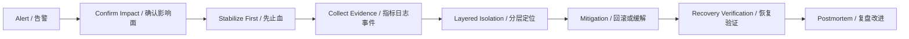

# SRE Incident Copilot / SRE 故障应急助手

`sre-incident-copilot` is a bilingual Codex skill and SRE portfolio project for incident response, Kubernetes troubleshooting, Prometheus alert triage, SLO thinking, and postmortem drafting.

这是一个面向 SRE/运维面试展示的 GitHub 作品：它把故障处理经验沉淀为可复用的 runbook、模板和安全脚本，重点展示 **先确认影响面、先止血、基于证据分层定位、验证恢复、复盘改进** 的稳定性方法论。

## 30-Second Value / 30 秒看懂价值

- **Incident response**: impact -> stabilize -> timeline -> evidence -> isolate -> mitigate -> verify -> learn
- **Kubernetes troubleshooting**: Pod, Deployment, Service, Ingress, Node, Events, NetworkPolicy
- **Observability**: Prometheus queries, logs, events, golden signals, recovery verification
- **SLO mindset**: SLI/SLO, error budget, alert quality, user impact, MTTR reduction
- **Safe automation**: scripts only generate checklists and postmortem drafts; they do not touch production
- **Interview-ready**: STAR placeholders, bilingual project pitch, demo flow, resume bullets

## Architecture / 工作流架构



## Demo in 3 Minutes / 3 分钟演示

Run the local demo without a real cluster:

```bash
python3 scripts/demo_incident.py
```

Try focused checklists:

```bash
python3 scripts/k8s_triage_checklist.py CrashLoopBackOff
python3 scripts/k8s_triage_checklist.py target_down
python3 scripts/k8s_triage_checklist.py 5xx
```

Generate an incident report draft:

```bash
python3 scripts/incident_report_template.py \
  --alert Service5xxSpike \
  --service checkout-api \
  --impact "5xx increased for checkout requests; SLO at risk" \
  --timeline "10:02 alert fired; 10:05 confirmed ingress 5xx; 10:12 rolled back latest deployment" \
  --root-cause "Latest release introduced dependency timeout regression" \
  --actions "Rolled back deployment; monitored Prometheus error rate; verified checkout synthetic check" \
  --followups "Add canary alert; improve dependency timeout test"
```

## Repository Map / 仓库结构

```text
.
├── SKILL.md                         # Codex skill entrypoint
├── agents/openai.yaml               # UI metadata for Codex skill discovery
├── docs/
│   ├── interview.md                 # 3-minute pitch, FAQ, resume bullets
│   ├── on-call-handoff.md           # On-call handoff template
│   └── slo-error-budget.md          # SLO and error budget template
├── examples/
│   ├── crashloopbackoff.md          # Anonymous K8s pod restart case
│   ├── prometheus-target-down.md    # Anonymous monitoring target case
│   └── service-5xx-spike.md         # Anonymous 5xx spike case
├── references/
│   ├── incident-playbooks.md        # Reusable playbooks
│   └── interview-showcase.md        # STAR placeholders and interview notes
└── scripts/
    ├── demo_incident.py             # Local no-cluster demo
    ├── incident_report_template.py  # Markdown postmortem generator
    └── k8s_triage_checklist.py      # Safe triage checklist printer
```

## Example Scenarios / 匿名故障案例

- [CrashLoopBackOff](examples/crashloopbackoff.md): app pods restart after config change; recover by rollback and probe validation.
- [Service 5xx Spike](examples/service-5xx-spike.md): 5xx rises after release; split ingress/app errors, roll back, verify golden signals.
- [Prometheus Target Down](examples/prometheus-target-down.md): monitoring target disappears; distinguish observability gap from user impact.

## Install as a Codex Skill / 安装为 Codex Skill

```bash
mkdir -p ~/.codex/skills
cp -R sre-incident-copilot ~/.codex/skills/
```

Invoke it with:

```text
Use $sre-incident-copilot to triage a Kubernetes or Prometheus incident and draft a concise postmortem.
```

Validate:

```bash
python3 /path/to/skill-creator/scripts/quick_validate.py ./sre-incident-copilot
```

## Interview Pitch / 面试表达

> I built this project to show how I turn SRE incident response into reusable, safe, AI-assisted runbooks. It does not operate production directly. It helps engineers structure evidence, choose reversible mitigations, verify recovery, and produce postmortems.

中文版本：

> 我做这个项目是为了展示我如何把运维/SRE 的故障处理经验沉淀成标准化、可复用、可审计的工作流。它不会直接操作生产，而是帮助工程师在故障中确认影响、先止血、分层定位、验证恢复，并形成复盘改进。

See [docs/interview.md](docs/interview.md) for a 3-minute demo script, FAQ answers, and resume bullets.

## Safety / 安全边界

This project does not include real company names, domains, IP addresses, cluster names, customer data, or production secrets. Scripts are intentionally read-only template generators.

Do not paste production secrets, tokens, customer data, or internal hostnames into prompts or examples.
